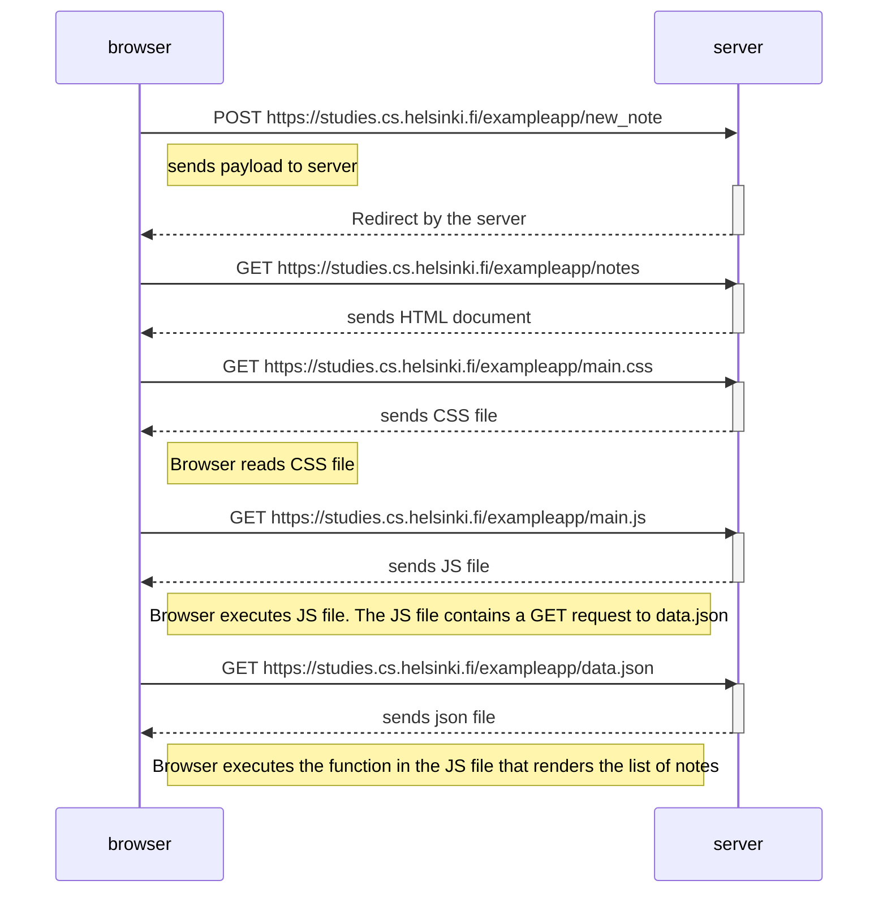

```mermaid
    sequenceDiagram

    browser->>server: POST https://studies.cs.helsinki.fi/exampleapp/new_note
    Note right of browser: sends payload to server
    activate server
    server-->>browser: Redirect by the server
    deactivate server

    browser->>server: GET https://studies.cs.helsinki.fi/exampleapp/notes
    activate server
    server-->>browser: sends HTML document
    deactivate server
    
    browser->>server: GET https://studies.cs.helsinki.fi/exampleapp/main.css
    activate server
    server-->>browser: sends CSS file
    deactivate server
    Note right of browser: Browser reads CSS file
    
    browser->>server: GET https://studies.cs.helsinki.fi/exampleapp/main.js
    activate server
    server-->>browser: sends JS file
    deactivate server
    Note right of browser: Browser executes JS file. The JS file contains a GET request to data.json
    
    browser->>server: GET https://studies.cs.helsinki.fi/exampleapp/data.json
    activate server
    server-->>browser: sends json file
    deactivate server
    Note right of browser: Browser executes the function in the JS file that renders the list of notes
```